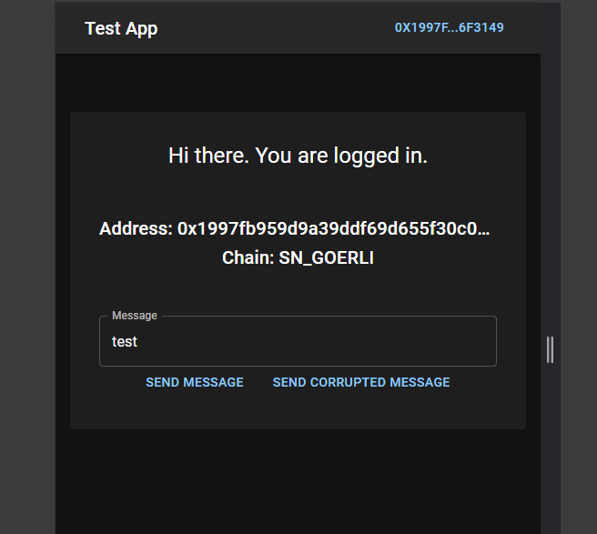
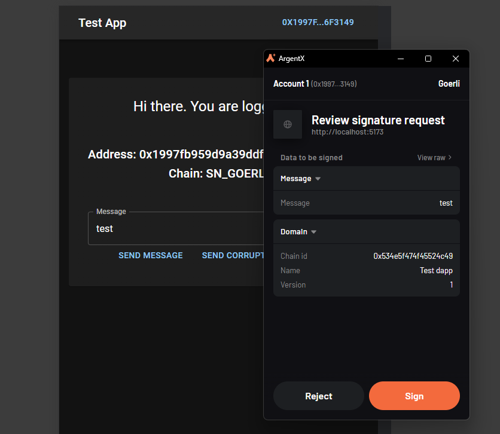
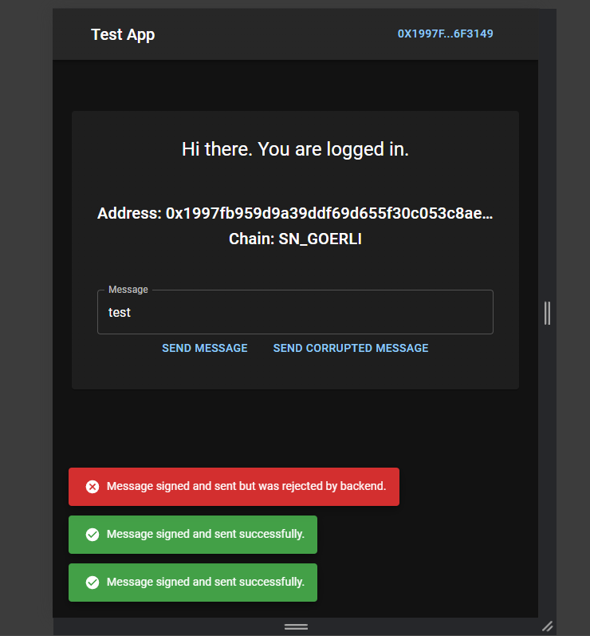
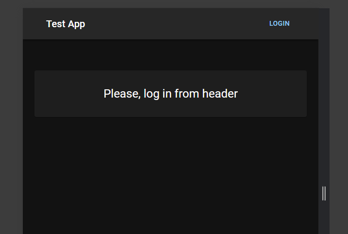
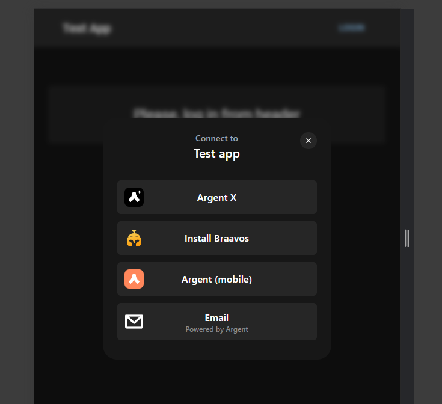

# Testing app for starknet

Small app that uses starknet.js and starknetkit.js 
for auth and sign messages.

App not sending data anywhere else. 

## Install

- Install all dependencies
```bash
yarn
```
- Run
```bash
yarn dev
```

## Screenshots











